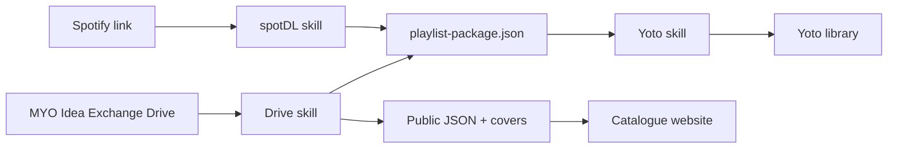

# Yoto AI Toolkit

> AI-assisted, confirmation-first workflows for discovering audio, preparing
> Make Your Own playlists, and publishing them safely to Yoto.


This repository contains three focused AI skills, a shared playlist package
contract, and a read-only catalogue website. Together they can:

- discover playlists in the Yoto MYO Idea Exchange Google Drive;
- prepare authorized Spotify-linked audio with `spotDL`;
- validate, preview, and publish complete playlists to Yoto;
- browse a public-safe, cached catalogue with search, filters, covers, and
  folder breadcrumbs.

## What's included

| Project | Purpose |
| --- | --- |
| [`yoto-ai`](./yoto-ai) | Authenticate with Yoto, inspect the library, detect possible duplicates, and publish a confirmed playlist package. |
| [`yoto-myo-idea-exchange-google-drive`](./yoto-myo-idea-exchange-google-drive) | Read-only discovery, indexing, packaging, and website-cache export for the configured MYO Idea Exchange folder. |
| [`spotdl-audio-import`](./spotdl-audio-import) | Resolve authorized Spotify links through `spotDL`, confirm the full batch once, and produce a portable playlist package. |
| [`catalogue-site`](./catalogue-site) | Static Vite/React catalogue browser designed for deployment on Vercel. |
| [`playlist-package-v1.schema.json`](./playlist-package-v1.schema.json) | Shared, versioned handoff contract used by the import and publishing skills. |



## Prerequisites

- Node.js 22 or later
- npm
- SQLite 3
- FFmpeg
- `7zz` or `7z` for 7z archives
- Python 3 and `spotDL` for Spotify-linked imports
- A connected, read-only Google Drive integration for MYO discovery
- A Yoto public API client for library access and publishing

On macOS, the system dependencies can be installed with:

```bash
brew install ffmpeg p7zip
```

## Setup

Install each project independently:

```bash
for project in \
  yoto-ai \
  yoto-myo-idea-exchange-google-drive \
  spotdl-audio-import \
  catalogue-site
do
  (cd "$project" && npm ci)
done

python3 -m pip install -r spotdl-audio-import/requirements.txt
```

### Configure Yoto

1. Create a **public client** at [dashboard.yoto.dev](https://dashboard.yoto.dev/).
2. Register this exact callback:

   ```text
   http://127.0.0.1:8787/callback
   ```

3. Enable the available library, content-management, and icon-management
   scopes.
4. Copy the ignored environment template and set `YOTO_CLIENT_ID` inside it:

   ```bash
   cd yoto-ai
   cp .env.example .env
   ```

5. Sign in:

   ```bash
   npm run yoto -- auth login --json
   ```

> [!IMPORTANT]
> Never create or provide a Yoto client secret. This toolkit uses a public
> OAuth client and stores Yoto tokens in the operating-system keychain.

See [`yoto-ai/README.md`](./yoto-ai/README.md) for detailed authentication and
recovery instructions.

## Common workflows

### Discover a Drive playlist

The Drive skill is restricted to:

```text
12ueGfirgSd21B7ShXZiATmrZCl3J4OqI
```

Its local catalogue is disposable; Drive remains authoritative.

```bash
cd yoto-myo-idea-exchange-google-drive
npm run catalogue -- index status --json
npm run catalogue -- search "ada twist" --json
```

Use the skill to perform the read-only Drive scan before searching or
packaging. When nested archives or folders are present, the skill reports all
candidates and asks which should be used.

### Prepare audio from Spotify

`spotDL` uses Spotify metadata to find audio on YouTube or YouTube Music. It
does not download audio from Spotify.

```bash
cd spotdl-audio-import
export SPOTDL_CONFIRMATION_SECRET="$(openssl rand -hex 32)"

npm run import -- resolve \
  --url "SPOTIFY_URL" \
  --title "Playlist title" \
  --save-file /tmp/batch.spotdl \
  --output /tmp/resolved.json
```

The skill resolves the entire batch, shows one consolidated preview, and
downloads only after explicit confirmation.

> [!WARNING]
> Only copy audio and artwork you are authorized to use. The toolkit does not
> bypass copyright, access controls, or service permissions.

### Preview and publish to Yoto

Inspect and preview a package without uploading:

```bash
cd yoto-ai

npm run yoto -- playlist inspect-package \
  --input /absolute/path/to/package \
  --json

npm run yoto -- playlist preview-create \
  --input /absolute/path/to/package \
  --output /tmp/yoto-preview.json \
  --json
```

`preview-create` checks the live Yoto library for exact and similar titles. If
a possible duplicate exists, it stops and reports the candidate card IDs.

After reviewing and explicitly confirming the complete preview:

```bash
npm run yoto -- playlist confirm \
  --preview /tmp/yoto-preview.json \
  --confirmation-file /tmp/yoto-confirmation \
  --json

npm run yoto -- playlist apply \
  --preview /tmp/yoto-preview.json \
  --confirmation-file /tmp/yoto-confirmation \
  --json
```

The ignored `yoto-ai/.env` file supplies `YOTO_CONFIRMATION_SECRET`; its value
never appears in a command. The mode-`0600` confirmation file keeps the
short-lived token out of command arguments and output.

Media uploads can resume from checksum-based checkpoints. The final Yoto card
mutation is attempted exactly once and is never retried automatically.

### Refresh and run the catalogue website

Ask the `yoto-myo-idea-exchange-google-drive` skill to **refresh the website
catalogue**. It will:

1. scan the configured Drive root read-only;
2. treat ZIP and 7z files as opaque albums;
3. download selected cover images only;
4. export public-safe JSON and WebP thumbnails to
   `catalogue-site/public/catalogue`.

The deterministic export boundary is:

```bash
cd yoto-myo-idea-exchange-google-drive

npm run catalogue -- cache build \
  --input /tmp/drive-items.json \
  --covers /tmp/drive-covers \
  --output ../catalogue-site/public/catalogue \
  --json
```

Run the site locally:

```bash
cd catalogue-site
npm run dev
```

For Vercel, create a project with `catalogue-site` as its root directory. The
included `vercel.json` builds the static site into `dist`.

> [!NOTE]
> The generated website cache is intended to be committed. It contains an
> explicit allowlist of album, folder, track-title, and cover metadata; owners,
> email addresses, permissions, credentials, and account metadata are excluded.

## Playlist package

Every import skill produces the same portable structure:

```text
playlist-package.json
audio/
icons/
cover.png
```

The manifest records provenance, permission, stable source IDs, ordering,
checksums, duration, format, cover, and optional icons. Before publishing,
`yoto-ai` rejects unsafe paths, missing files, checksum mismatches, duplicate
positions, and unsupported media.

## Development

Run the checks for a project from its directory:

```bash
npm test
npm run check
npm run build
```

The catalogue website additionally supports:

```bash
npm audit --audit-level=high
```

Generated playlists, dependencies, build output, coverage, logs, and TypeScript
build metadata are excluded from Git.
